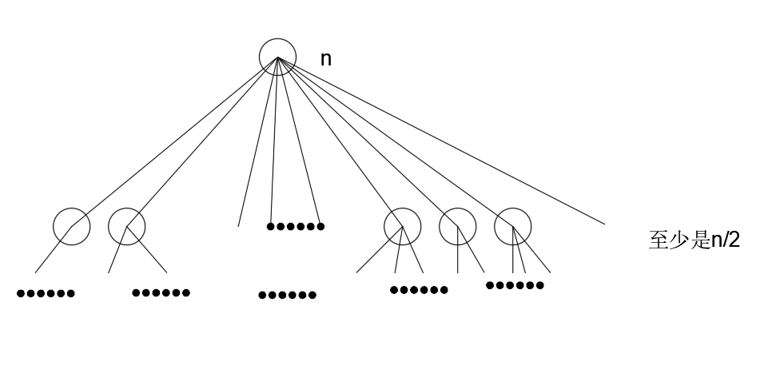

**整数因子分解问题**

**问题描述**

大于 1 的正整数$n$可以分解为:$n=x_1*x_2*...x_m$。

例如，当$n=12$时，共有如下8中不同的分解式。

$12=12$

$12=6\times2$

$12=4\times3$

$12=3\times4$

$12=2\times6$

$12=2\times2\times3$

$12=3\times2\times2$

$12=2\times3\times2$

**编程任务**

对于给定的正整数$n$，编程计算$n$有多少种不同的分解式。

**数据输入**

由文件 input.txt 给出输入数据。第一行由一个正整数$n(n\leq n\leq 2000000000)$。

input.txt | output.txt 
----------|----------
12        |8

**分析**

* 正确性分析

对于因子$n$，可以将其每次都对小于它的数取余。如果有取余之后为 0，也就是可以整除的，就加 1，再对这个可以取余为 0 的数进行相同的做法，最后得到所有数的点+1就是要求的因子的总数。

因为取余等于 0 一次说明这个因子是存在的，而这个因子此次就可以和别的因子匹配到$n$，然后就要检查这个因子是不是还能够继续分解，如果可以继续分解，那么继续分解得到的因子还可以和相同的配对因子组合成$n$。所以数因子的数目是可行的。

但是数因子的数目会导致漏掉一个因子式子:$n=n\times1$，数因子式子的时候不能加入这个到递归，否则会陷入死循环。所以这样数出来的数目，要在整个递归函数外面+1。

另一种方法是直接数边数，将每个点到最后都会有自己与自己整除等于 0 得到一条额外的边，可以容易的看出，这个边数会比因子点数多 1，这个方法会比较简单。

之前我先想到的是数因子数目，所以这两种方法我都写了函数。

* 复杂度分析

复杂度可以很容易的从图中看出，每次递归调用，都至少会下降一半的规模，而且在调用函数的时候，额外做的操作也就是扫一遍$n$个数，即有下述的表达式存在
$$
T(1)=O(1)\\
T(n)\leq T(n/2)+O(n)
$$
这个递归公式的最终结果是复杂度为$O(n\log n)$。

**代码**

* 第一种方法的代码：
```
#include<iostream>

using namespace std;

int getRealCounterFactor(int n)
{
    return getCounterFactor(n)+1;
}

int getCounterFactor(int n)
{
    int counter=0;
    for(int i=2;i<n;i++)
    {
        if(n%i==0 && n>2)
        {
            counter++;
            if(i>2)
                counter = counter + getCounterFactor(i);
        }
    }
    return counter;
}

int main()
{
    int x;
    cin>>x;
    cout<<getRealCounterFactor(x)<<endl;
    return 0;
}
```
* 第二种方法的代码
```
#include<iostream>

using namespace std;

int getCounterFactor(int n)
{
    int counter =0;
    if(n==1)counter++;
    else
    {
        for(int i = 2; i <= n; i++)
        {
            if(n%i==0)
            {
                counter=counter+getCounterFactor(n/i);
            }
        }
    }
    return counter;
}

int main()
{
    int x;
    cin>>x;
    cout<<getCounterFactor(x)<<endl;
    return 0;
}
```
