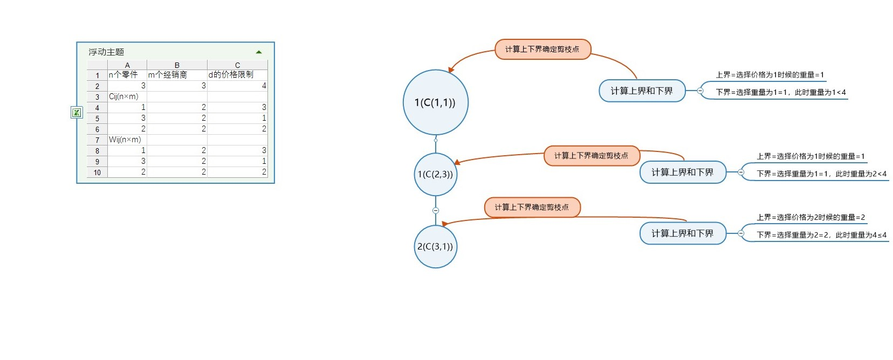

# 最小机器重量设计问题
使用分支限界法计算最小机器重量设计问题，优化目标是$min\Sigma_{i=1}^{m}w_{ij}$，选择过程的限制条件是$\Sigma_{i=1}^{m}c_{ij}<d$，选择代价函数$f$=当前选择的重量+下一个价格最小的物品的重量，这个作为选择下一个物品的上界，如果下一个选择的物品超过这个上界，则进行剪枝处理。下界选择为下一个重量最小的函数，并且计算验证其价格不超过总价格$d$，否则也进行剪枝处理。

总的处理思路如下：

选择数据结构为重量的优先队列，以重量升序排列优先等级，优先级由高到低为$w_1<w_2<w_3<w_4...$实现优先队列的方式使用最小堆实现，每一行都是一个最小堆。最小堆的建立需要的复杂度为$O(3n/2)=O(n)$，相比于遍历搜索常数上有所下降，但是在求解多个子树最小值问题上面相比于遍历搜索$O(n^x)$有很大的改进，最小堆的复杂度还是$O(n)$。

在建立好最小堆之后，我只需要从顶点开始，从上往下取根节点即可，取得的根节点一定是该子树中重量最小的，如果找到了不满足的根节点，则将这棵子树肯定都不满足限定条件。如果其满足上下界的条件，则加入活结点列表，继续下一个扩展节点的搜索。这里的搜索策略选择为宽度优先。 

另一种方法是使用排序，也就是使用数组的方式来实现优先队列。这个方法可以降低代码的复杂度，但是在时间复杂度上面会比堆实现优先队列要差。