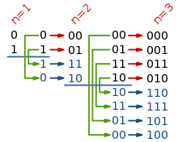
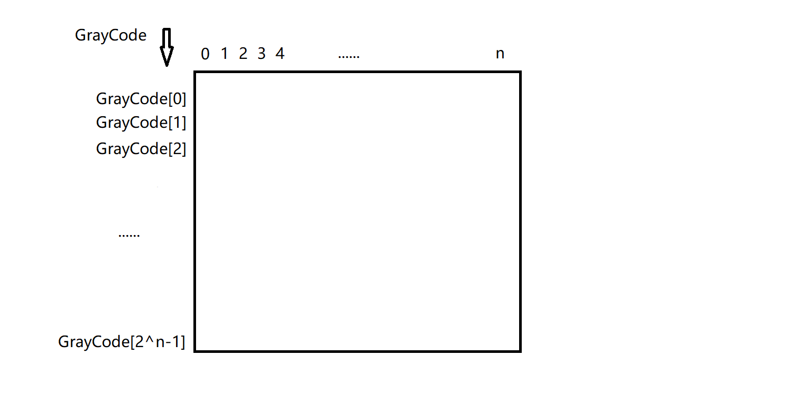
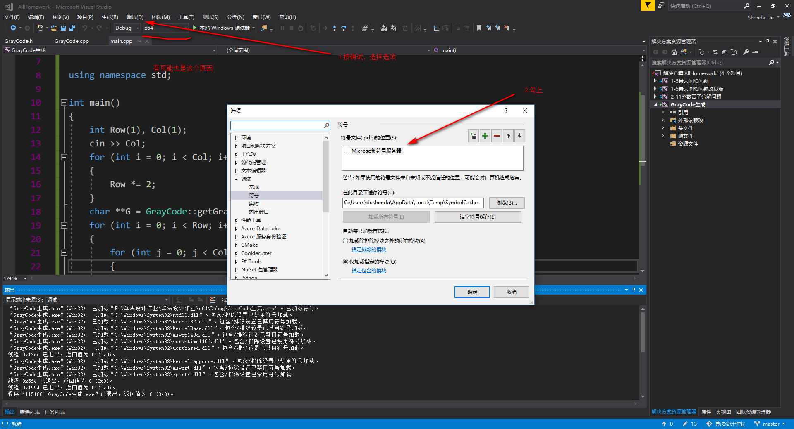

# 格雷码生成

## 简介

典型的二进制格雷码（Binary Gray Code）简称格雷码，因1953年公开的弗兰克·格雷（Frank Gray，18870913-19690523）专利“Pulse Code Communication”而得名，当初是为了通信，现在则常用于模拟－数字转换和位置－数字转换中。法国电讯工程师波特（Jean-Maurice-Émile Baudot，18450911-19030328）在1880年曾用过的波特码相当于它的一种变形。1941年George Stibitz设计的一种8元二进制机械计数器正好符合格雷码计数器的计数规律。

## 生成

### 递归生成码表

这种方法基于格雷码是反射码的事实，利用递归的如下规则来构造：

1. 1位格雷码有两个码字
2. (n+1)位格雷码中的前2n个码字等于n位格雷码的码字，按顺序书写，加前缀0
3. (n+1)位格雷码中的后2n个码字等于n位格雷码的码字，按逆序书写，加前缀1 [4] 
4. n+1位格雷码的集合 = n位格雷码集合(顺序)加前缀0 + n位格雷码集合(逆序)加前缀1

| 2位格雷码 | 3位格雷码 | 4位格雷码 | 4位自然二进制码 |
| :-------: | :-------: | :-------: | :-------------: |
|    00     |    000    |   0000    |      0000       |
|    01     |    001    |   0001    |      0001       |
|    11     |    011    |   0011    |      0010       |
|    10     |    010    |   0010    |      0011       |
|           |    110    |   0110    |      0100       |
|           |    111    |   0111    |      0101       |
|           |    101    |   0101    |      0110       |
|           |    100    |   0100    |      0111       |
|           |           |   1100    |      1000       |
|           |           |   1101    |      1001       |
|           |           |   1111    |      1010       |
|           |           |   1110    |      1011       |
|           |           |   1010    |      1100       |
|           |           |   1011    |      1101       |
|           |           |   1001    |      1110       |
|           |           |   1000    |      1111       |
|           |           |           |                 |

### C++程序

首先应该设置一个二维数列来存储格雷码，就像矩阵那样。

输入 n 位，存储的格雷码数目为 $2^n -1$。

- 设置一个 `**GrayCode` 作为二维数组的头指针， `*GrayCode[i]`作为每行元素的头指针，动态申请内存空间
- 要生成 `n` 位格雷码则需要得到 `n-1` 位格雷码，这就是递归出现了
- 递归的边界也就是第一位，这个时候格雷码就是 `0，1`
- 在递归反推的时候，使用镜构法，将数列复制一次得到双份，在一半处，前一段按照原样不变，后一段逆序复制（逆序指的是行逆序，也就是最后一个格雷码到后半段的第一个）
- 在前半段首位加 `0`，后半段首位加 `1`，合并输出

代码见项目文件

需要花功夫的也就是要理解 C++ 的动态内存分配和指针的一些知识，还有就是这个循环赋值要注意一下边界。

### 算法复杂度

复杂度分析也比较容易，递归式子
$$
T(1)=O(1)\\
T(n)=T(n-1)+O(n)
$$
最终的复杂度就是
$$
T(n)=O(n^2)
$$
其实是有点高的，因为每次递归时候需要操作是扫遍每一个元素，然后递归下降又是每次仅仅是 1 ，要下降 n 次才行。

### VS2017的一个小错误解决

在调试的时候突然出现了一个对话框提示程序已经出现一个断点，然后跳转界面提示未加载 `wntdll.pdb`。这个解决方法按照网上说是需要下面的步骤

然后就会有一个加载符号的窗口，但是我发现即使在我加载完成之后，问题也并没有解决。

之后我就去打开了之前的项目，看有没有一样的问题，因为问题之前是没有的，这个出现按是莫名其妙的，结果之前的项目没有问题。

然后我就对比并且回忆了一下，我把 `Debug`选项调整到了 `Any CPU`，之前是 `x86`，但是计算机是 64 位的，所以我就把这个 `Debug` 修改成 `x64`，完美运行，没有问题。

## 应用

### 角度传感器

机械工具，汽车制动系统有时需要传感器产生的数字值来指示机械位置。如图是编码盘和一些触点的概念图，根据盘转的位置，触点产生一个3位二进制编码，共有8个这样的编码。盘中暗的区域与对应的逻辑1的信号源相连；亮的区域没有连接，触点将其解释为逻辑0。使用格雷码对编码盘上的亮暗区域编码，使得其连续的码字之间只有一个数位变化。这样就不会因为器件制造的精确度有限，而使得触点转到边界位置而出现错误编码。

### 格雷码

在化简[逻辑函数](https://baike.baidu.com/item/%E9%80%BB%E8%BE%91%E5%87%BD%E6%95%B0)时，可以通过按格雷码排列的[卡诺图](https://baike.baidu.com/item/%E5%8D%A1%E8%AF%BA%E5%9B%BE)来完成。

### 九连环问题

智力玩具[九连环](https://baike.baidu.com/item/%E4%B9%9D%E8%BF%9E%E7%8E%AF/23636)的状态 变化符合格雷码的编码规律，汉诺塔的解法也与格雷码有关。

九连环中的每个环都有上下两种状态，如果把这两种状态用0/1来表示的话，这个状态序列就会形成一种循环二进制编码（格雷码）的序列。所以解决九连环问题所需要的状态变化数就是格雷码111111111所对应的十进制数341。

