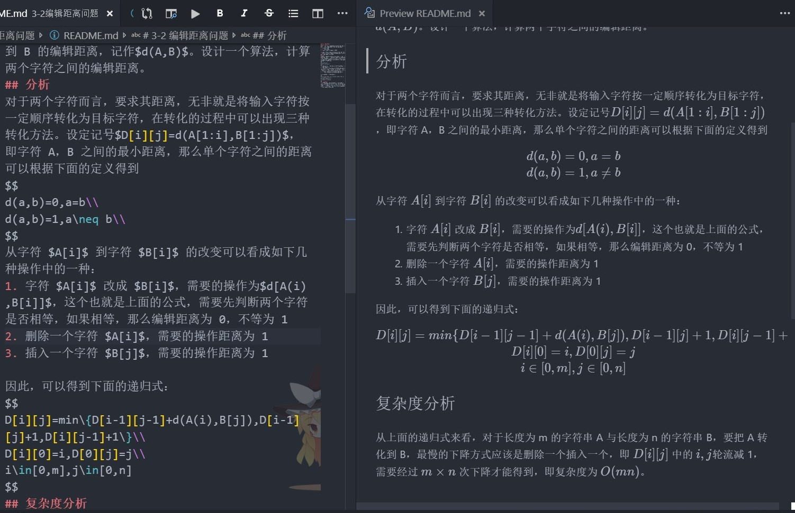

# VSCode 代码
网页显示的公式会以$\LaTeX$形式出现，所以下载到本地使用专用的 `Markdown` 软件打开就行了。比如 `Typora`(如果显示不了，需要去高级设置里面设置)，装有 `Markdown插件` 的 `VSCode`，显示会是这样:

## 机器最优时间问题
## [编辑距离问题](./3-2编辑距离问题/README.md)
## [磁盘文件最优存储问题](./4-4磁盘文件最优存储问题/README.md)