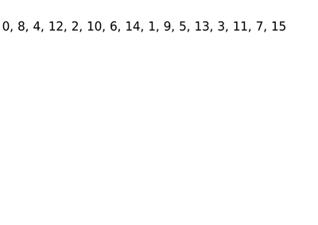

# 最长单调子序列问题——高效算法

> [参考维基百科](https://en.wikipedia.org/wiki/Longest_increasing_subsequence)
>
> 在[计算机科学](https://zh.wikipedia.org/wiki/%E8%AE%A1%E7%AE%97%E6%9C%BA%E7%A7%91%E5%AD%A6)中，**最长递增子序列**（**longest increasing subsequence**）问题是指，在一个给定的数值序列中，找到一个子序列，使得这个子序列元素的数值依次递增，并且这个子序列的长度尽可能地大。最长递增子序列中的元素在原序列中不一定是连续的。许多与数学、[算法](https://zh.wikipedia.org/wiki/%E7%AE%97%E6%B3%95)、[随机矩阵理论](https://zh.wikipedia.org/w/index.php?title=%E9%9A%8F%E6%9C%BA%E7%9F%A9%E9%98%B5%E7%90%86%E8%AE%BA&action=edit&redlink=1)、[表示论](https://zh.wikipedia.org/wiki/%E8%A1%A8%E7%A4%BA%E8%AE%BA)相关的研究都会涉及最长递增子序列。[[1\]](https://zh.wikipedia.org/wiki/%E6%9C%80%E9%95%BF%E9%80%92%E5%A2%9E%E5%AD%90%E5%BA%8F%E5%88%97#cite_note-1)解决最长递增子序列问题的算法最低要求O(*n* log *n*)的时间复杂度，这里*n*表示输入序列的规模。[[2\]](https://zh.wikipedia.org/wiki/%E6%9C%80%E9%95%BF%E9%80%92%E5%A2%9E%E5%AD%90%E5%BA%8F%E5%88%97#cite_note-schensted-2)

吐槽一下一些中文博客，有些质量真的很差，还一直搬运，抄，不写转载。

这篇[中文博客](https://segmentfault.com/a/1190000012754802)写的很好。

参考上面的中文博客

下面以序列 `2，1，4，3，8，5，9` 为例

## 要存哪些最长递增子序列

要存对应每个长度**结尾数字最小**的序列，这种序列最有可能在后面继续添加元素。比如序列 `1，4`和序列 `1，3`，你觉得哪个有可能更长，肯定是 `1，3`，因为 `3` 比 `4` 小，`3` 后面更有可能加数。

| 序列长度 | 对应的序列 |
| :------- | ---------- |
| 1        | 1          |
| 2        | 1，4       |
| 3        | 1，3，5    |

算法的核心应该是取下一个数字，从下往上比较后两个，

- 如果大于最后一个，那么就加在这个序列的最后但是不影响前面的已经做好的序列；
- 丢弃同长度，但是结尾元素大的序列。

> 从[博客](https://segmentfault.com/a/1190000012754802)复制
>
> ## 应该存储哪些递增子序列
>
> 从左到右扫描输入的过程中，我们能够构造出很多种**递增子序列**，我们要存储这些中间子序列，以便**与将来扫描到的元素拼接**，产生更长的递增子序列。如此往复，最终产生最长的递增子序列。
> 比如对于输入`2, 11, 4, 12, 6, 1`，当扫描到`6`的时候，我们用**已经扫描过的**元素可以构造出：
>
> - 4个**只包含一个元素**的递增子序列：`2`，`11`，`4`，`12`
> - 2个包含**包含两个元素**的递增子序列：`2, 4`，`11, 12`
>
> 显然，如果将所有可以构造出的子序列都存储起来，不但浪费**空间**，而且在查找符合条件的子序列的时候也会消耗很多**时间**。我们只需要存储那些**“有潜质”**的递增子序列。“有潜质”表示这个子序列更有可能构造出LIS，它包含两个方面的标准：
>
> - 长度越长越好
> - 结尾元素的值越小越好
>
> 对于`2, 11, 4, 12, 6, 1`的例子，在`6`之前构造的那些子序列，很多是不需要存储的：
>
> - 存储`2, 4`而不需要存储`4`（结尾元素相同而长度更短）
> - 存储`2, 4`而不需要存储`11, 12`（长度相同而结尾元素更大）
>
> 但是，我们存储了`2, 4`，还要不要存储`2`呢？**它虽然结尾元素更小，但是长度也更小。**
> 答案是要的，考虑`2, 5, 3, 1, 2, 3, 4, 5, 6`在扫描到`1`的时候，已经存储了`2, 3`，但是如果不存储单元素递增子序列`1`，最终就没办法构造出LIS`1, 2, 3, 4, 5, 6`。
> **那些结尾元素更小的递增子序列，即使现在长度还很短，但是将来可能接收更多的元素，成为最长递增子序列。因此，那些结尾元素更小的节点也要存储。**
>
> 综上所述，对于**每一种长度**的递增子序列，我们都要存储一个结尾元素最小的。
>
> ## 如何存储构造出递增子序列
>
> 按照上面的结论，我们可以在实现算法的时候，使用一个数组`buildingLists`，数组的第n项存储**长度为n**的“**最**有潜质的”（也就是结尾元素最小的）递增子序列。
>
> > 我们只在意序列的长度和结尾元素，序列前面的那些元素不会对将来添加元素造成影响。因此**存储递增序列的时候只需要存结尾元素**，子序列在`buildingLists`中的下标就是它的长度。
>
> **按照这种方式存储的buildingLists，其中每个子序列的结尾元素必定是严格递增的（长度更长的序列一定结尾元素更大）。**可以用反证法证明：
> 假设`i<j`，但是`buildingLists[j]`**(最有潜质的长度为j的递增子序列)**的结尾元素比`buildingLists[i]`的结尾元素更小或相等。可以推理出：`buildingLists[j]`代表的子序列，只要取出它的**前i项**就是一个比`buildingLists[i]`更好的子序列。可是按照定义，`buildingLists[i]`才应该是最有潜质的、长度为i的递增子序列啊！这就推出了一个矛盾。
>
> ## 扫描时如何构造递增序列
>
> 好，现在我们已经知道要**存储哪些、如何存储**目前已经构造出的递增子序列，那么我们要如何在扫描的过程中构造递增子序列呢？原理是很简单的：如果当前扫描到的元素比**某个已有子序列的结尾元素**更大，那么就可以将当前元素拼接到这个子序列的后面。
>
> 但是，如果有多个子序列（每个子序列长度不同）都满足这个要求呢？此时应该选择**尽可能长的**（等价于**结尾元素尽可能大**）那个已有子序列来拼接。其中的道理可以用通俗的话来解释：假设新扫描到的元素是X，反正不管拿哪个已有序列来拼接X，拼接以后结尾元素必定是X（结尾元素可以确定），那还不如拿一个原本就最长的那个子序列来和X拼接，得到的新序列能更长一点！
>
> 比如已经有这3个子序列：
>
> - 0
> - 0, 4
> - 0, 4, 12
>
> 现在扫描到8。前两个序列都可以在后面拼接8。反正不管拿`0`还是`0, 4`来拼接，拼接完以后的结尾元素都是8，那当然是用`0, 4`来拼接啊！得到的新序列长度更大！
> 拼接以后得到了`0, 4, 8`，显然比`0, 4, 12`更有潜质，因此将`buildingLists[3]`从12更新为更好的8。

> 现在看一个[完整的例子](https://www.geeksforgeeks.org/longest-monotonically-increasing-subsequence-size-n-log-n/)来测试我们已经有的思路。输入为`0, 8, 4, 12, 2, 10, 6, 14, 1, 9, 5, 13, 3, 11, 7, 15`：

> ```c
> A[0] = 0. Case 1. There are no active lists, create one.
> 0.
> -----------------------------------------------------------------------------
> A[1] = 8. Case 2. Clone and extend.
> 0.
> 0, 8.
> -----------------------------------------------------------------------------
> A[2] = 4. Case 3. Clone, extend and discard.
> 0.
> 0, 4.
> 0, 8. Discarded
> //0<4<8
> -----------------------------------------------------------------------------
> A[3] = 12. Case 2. Clone and extend.
> 0.
> 0, 4.
> 0, 4, 12.
> //12>4
> -----------------------------------------------------------------------------
> A[4] = 2. Case 3. Clone, extend and discard.
> 0.
> 0, 2.
> 0, 4. Discarded.
> 0, 4, 12.
> //对于
> -----------------------------------------------------------------------------
> A[5] = 10. Case 3. Clone, extend and discard.
> 0.
> 0, 2.
> 0, 2, 10.
> 0, 4, 12. Discarded.
> -----------------------------------------------------------------------------
> A[6] = 6. Case 3. Clone, extend and discard.
> 0.
> 0, 2.
> 0, 2, 6.
> 0, 2, 10. Discarded.
> -----------------------------------------------------------------------------
> A[7] = 14. Case 2. Clone and extend.
> 0.
> 0, 2.
> 0, 2, 6.
> 0, 2, 6, 14.
> -----------------------------------------------------------------------------
> A[8] = 1. Case 3. Clone, extend and discard.
> 0.
> 0, 1.
> 0, 2. Discarded.
> 0, 2, 6.
> 0, 2, 6, 14.
> -----------------------------------------------------------------------------
> A[9] = 9. Case 3. Clone, extend and discard.
> 0.
> 0, 1.
> 0, 2, 6.
> 0, 2, 6, 9.
> 0, 2, 6, 14. Discarded.
> -----------------------------------------------------------------------------
> A[10] = 5. Case 3. Clone, extend and discard.
> 0.
> 0, 1.
> 0, 1, 5.
> 0, 2, 6. Discarded.
> 0, 2, 6, 9.
> -----------------------------------------------------------------------------
> A[11] = 13. Case 2. Clone and extend.
> 0.
> 0, 1.
> 0, 1, 5.
> 0, 2, 6, 9.
> 0, 2, 6, 9, 13.
> -----------------------------------------------------------------------------
> A[12] = 3. Case 3. Clone, extend and discard.
> 0.
> 0, 1.
> 0, 1, 3.
> 0, 1, 5. Discarded.
> 0, 2, 6, 9.
> 0, 2, 6, 9, 13.
> -----------------------------------------------------------------------------
> A[13] = 11. Case 3. Clone, extend and discard.
> 0.
> 0, 1.
> 0, 1, 3.
> 0, 2, 6, 9.
> 0, 2, 6, 9, 11.
> 0, 2, 6, 9, 13. Discarded.
> -----------------------------------------------------------------------------
> A[14] = 7. Case 3. Clone, extend and discard.
> 0.
> 0, 1.
> 0, 1, 3.
> 0, 1, 3, 7.
> 0, 2, 6, 9. Discarded.
> 0, 2, 6, 9, 11.
> ----------------------------------------------------------------------------
> A[15] = 15. Case 2. Clone and extend.
> 0.
> 0, 1.
> 0, 1, 3.
> 0, 1, 3, 7.
> 0, 2, 6, 9, 11.
> 0, 2, 6, 9, 11, 15. <-- LIS List
> ----------------------------------------------------------------------------
> ```

`0, 8, 4, 12, 2, 10, 6, 14, 1, 9, 5, 13, 3, 11, 7, 15`的序列变化(**取斜线**)

| 序列               | 对应的的序列数 |
| ------------------ | -------------- |
| 0                  | A[0]=0         |
| 0, 8               | A[1]=8         |
| 0, 4               | A[2]=4         |
| 0, 4, 12           | A[3]=12        |
| 0, 2, 12           | A[4]=2         |
| 0, 2, 10           | A[5]=10        |
| 0, 2, 6            | A[6]=6         |
| 0, 2, 6, 14        | A[7]=14        |
| 0, 1, 6, 14        | A[8]=1         |
| 0, 1, 6, 9         | A[9]=9         |
| 0, 1, 5, 9         | A[10]=5        |
| 0, 1, 5, 9, 13     | A[11]=13       |
| 0, 1, 3, 9, 13     | A[12]=3        |
| 0, 1, 3, 9, 11     | A[13]=11       |
| 0, 1, 3, 7, 11     | A[14]=7        |
| 0, 1, 3, 7, 11, 15 | A[15]=15       |

从上表看出，算法需要扫一遍 n 个数，然后对于扫到的第 i 个数进行判断，在当前序列中找到大于它和小于它的数，将其插在中间，去掉后面的一个数。

例如在 A[8]=1 进行操作的时候，一个个找，找到了 0<1<2 ，则将其放在 0与2 之间，并且删去 2，或者可以看成替代 2，这就是一个查找的计算过程，根据先前的知识，查找的复杂度最好的是 O(log n)。那么对于 n 个数这么操作一次，复杂度也就是 O(nlog n)。

算法介绍

> ## [Efficient algorithms](https://en.wikipedia.org/w/index.php?title=Longest_increasing_subsequence&action=edit&section=3)
>
> The algorithm outlined below solves the longest increasing subsequence problem efficiently with arrays and [binary searching](https://en.wikipedia.org/wiki/Binary_search). It processes the sequence elements in order, maintaining the longest increasing subsequence found so far. Denote the sequence values as X[0], X[1], etc. Then, after processing X[*i*], the algorithm will have stored values in two arrays:
>
> In addition the algorithm stores a variable L representing the length of the longest increasing subsequence found so far. Because the algorithm below uses [zero-based numbering](https://en.wikipedia.org/wiki/Zero-based_numbering), for clarity M is padded with M[0], which goes unused so that M[*j*] corresponds to a subsequence of length *j*. A real implementation can skip M[0] and adjust the indices accordingly.
>
> Note that, at any point in the algorithm, the sequence
>
> is increasing. For, if there is an increasing subsequence of length *j* ≥ 2 ending at X[M[*j*]], then there is also a subsequence of length *j*-1 ending at a smaller value: namely the one ending at X[P[M[*j*]]]. Thus, we may do binary searches in this sequence in logarithmic time.
>
> The algorithm, then, proceeds as follows:
>
> 
>
> 

> ```c
>  P = array of length N
>  M = array of length N + 1
> 
>  L = 0
>  for i in range 0 to N-1:
>    // Binary search for the largest positive j ≤ L
>    // such that X[M[j]] <= X[i]
>    lo = 1
>    hi = L
>    while lo ≤ hi:
>      mid = ceil((lo+hi)/2)
>      if X[M[mid]] <= X[i]:
>        lo = mid+1
>      else:
>        hi = mid-1
> 
>    // After searching, lo is 1 greater than the
>    // length of the longest prefix of X[i]
>    newL = lo
> 
>    // The predecessor of X[i] is the last index of 
>    // the subsequence of length newL-1
>    P[i] = M[newL-1]
>    M[newL] = i
> 
>    if newL > L:
>      // If we found a subsequence longer than any we've
>      // found yet, update L
>      L = newL
> 
>  // Reconstruct the longest increasing subsequence
>  S = array of length L
>  k = M[L]
>  for i in range L-1 to 0:
>    S[i] = X[k]
>    k = P[k]
> 
>  return S
> ```
>
> Because the algorithm performs a single binary search per sequence element, its total time can be expressed using [Big O notation](https://en.wikipedia.org/wiki/Big_O_notation) as O(*n* log *n*). [Fredman (1975)](https://en.wikipedia.org/wiki/Longest_increasing_subsequence#CITEREFFredman1975) discusses a variant of this algorithm, which he credits to [Donald Knuth](https://en.wikipedia.org/wiki/Donald_Knuth); in the variant that he studies, the algorithm tests whether each value X[*i*] can be used to extend the current longest increasing sequence, in constant time, prior to doing the binary search. With this modification, the algorithm uses at most *n* log2 *n* − *n* log2log2 *n* + O(*n*)comparisons in the worst case, which is optimal for a comparison-based algorithm up to the constant factor in the O(*n*) term.[[5\]](https://en.wikipedia.org/wiki/Longest_increasing_subsequence#cite_note-5)

